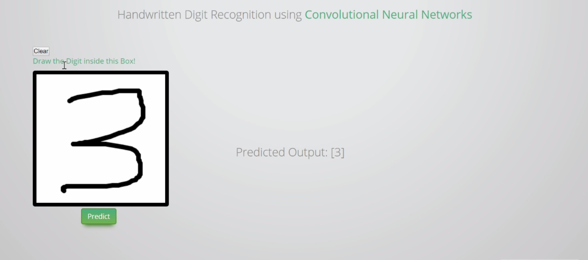

# 手写识别web端部署

  



#### 数据来源

使用的是[MNIST](http://yann.lecun.com/exdb/mnist/)，keras有内置数据集，使用起来更加方便。

#### 依赖安装
 
项目使用的是`python3.5`，`python2.7`照样可以运行。
 
安装依赖

```
sudo pip install -r requirements.txt
```

#### 使用

```python
python webapp.py
```

然后就可以通过浏览器访问了。

